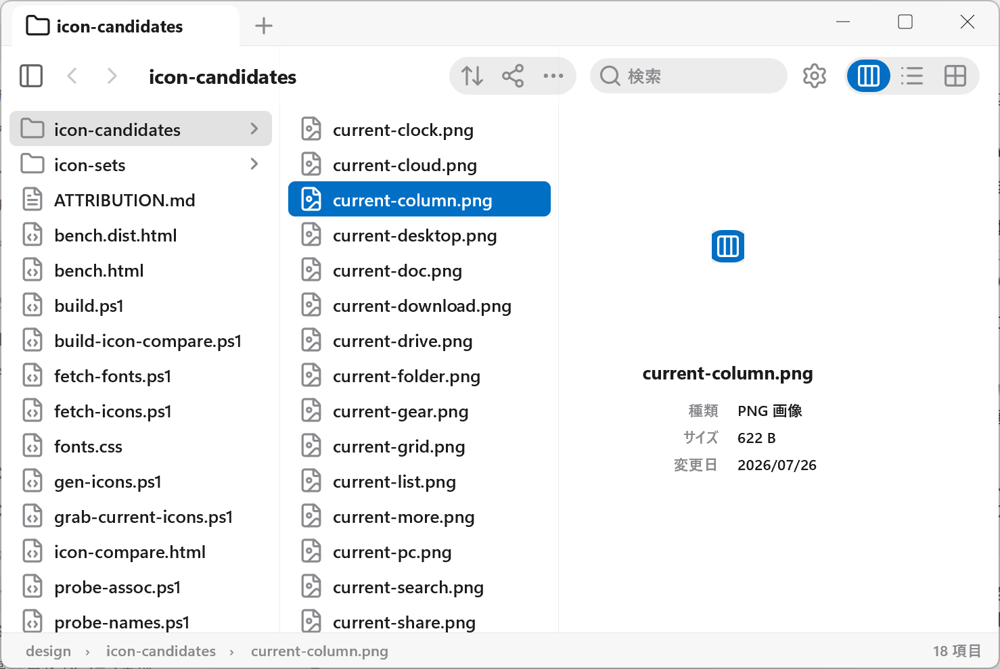
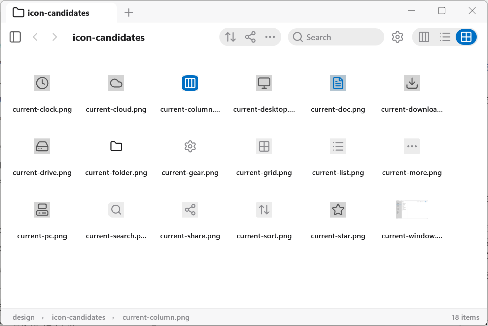

# Oriel

**自分で描くWindows用ファイラと、それになりうるファイルダイアログ。**

[](https://github.com/194754hs/oriel/actions/workflows/ci.yml)
[](LICENSE)

English: **[README.md](README.md)**

**[0.1.0 をダウンロード (Windows x64)](https://github.com/194754hs/oriel/releases/latest)** — 展開して `oriel.exe` を実行。ファイラ側は何も登録しません。同梱のダイアログシムは `shim-control.ps1` を実行するまで不活性です（[先に読んでください](#ダイアログのシム)）。コード署名はありません。



Oriel は Direct3D 11 / Direct2D / DirectComposition / DirectWrite に対して C++20 で書いた、ネイティブの Windows ファイラです。UIフレームワークは下に敷いていません。ウィンドウは枠なしで、その中の全ピクセルをアプリ自身がコンポジションサーフェス上に描くので、フレームの一部を本当に透過させてデスクトップの背景を通せます。

移動は**カラム**で行います。フォルダーに入るたびに右へ新しいカラムが開くので、辿ってきた経路が画面に残り、どの階層へでも位置を見失わずに戻れます。

シェルの隣に、もう一つ小さな部品があります。**システムのファイルダイアログのクラスに対してユーザー単位で登録される、インプロセスCOMサーバー**です。アプリが要求する「開く」「保存」のダイアログを、いずれ Oriel 自身のカラム表示に置き換えるためのもの。他人のプロセスに読み込まれるDLLなので、下で全部説明します。

各カラムが自分の選択・スクロール位置・複数選択のアンカーを持つので、片方をいじってももう片方で選んでいたものは崩れません。ファイルを選ぶと隣にプレビューが開き、辿ってきた経路が下端に並びます。



グリッド・リスト・カラムの3表示は同じモデルを共有していて、切り替えは状態ではなく見せ方だけが変わります。

UIは**日本語と英語**です。Windowsの表示言語に従い、設定ファイルの `general.lang` で固定できます（`0` 自動 / `1` 日本語 / `2` 英語）。

> **状態: 初期。** シェルは動き、移動し、描画し、ファイルを操作します。ダイアログのシムは**意図的にまだ素通し**です — 登録され、到達され、そして本物のダイアログへそのまま渡します。何かを置き換えられると期待する前に[現状](#現状)を読んでください。

---

## ビルド

Visual Studio 2022 (MSVC v143)、Windows 11 SDK、CMake 3.21 以降。Win32とDirectXで書かれているのでWindows専用です。

```powershell
# シェル・シム・シムのテストハーネス (x64)
cmake -B build -A x64
cmake --build build --config Debug

# Release
cmake -B build-rel -A x64 -DCMAKE_BUILD_TYPE=Release
cmake --build build-rel --config Release

# 32bit版のシム。64bitのDLLは32bitアプリに読み込めず、
# 保存ダイアログを出すアプリには32bitのものがまだ多くある。
cmake -B build-x86 -A Win32 -DORIEL_SHIM_ONLY=ON
cmake --build build-x86 --config Release
```

`oriel.exe [フォルダー]` でその場所を開きます。シェルから仕事を渡される経路なので最初から通してあります。

ビルドのたびに `THIRD-PARTY-NOTICES.txt` を実行ファイルの隣へコピーします。これは礼儀ではなく義務です。埋め込んだアイコンの輪郭は ISC と MIT で、どちらも表記をバイナリと一緒に運ぶことを条件にしています。自動でコピーする以外に、パッケージング時に忘れない方法がありません。

## 検証

```powershell
# シムを直接読み込み、ユーザー単位の上書きが入った後にCOMがやるのと
# 同じ手順でダイアログを要求する。レジストリには触れず、システムの状態を変えない。
# 保存/開くの両方で31項目。未知のインターフェイスが本物へ落ちること、
# 保存ダイアログが IFileOpenDialog を拒むこと、そして Show が実際に開いたことを
# 「呼び出しが返った」ではなく「イベントシンクが発火した」で確かめることまで含む。
build\Debug\shim_test.exe

# ユーザー単位の上書きの登録 / 解除 / 確認
shim\shim-control.ps1
```

`design\verify-*.ps1` は実際の入力でウィンドウを操作してスクリーンショットを撮るハーネスで、機能を**ソースからではなく画面から報告**します。出力先は `artifacts\`。これらは目視用であってアサーション群ではありません。自力で合否が出るのは `shim_test` だけです。

CI は `windows-latest` で x64 と x86 をビルドし、`shim_test` を実行します。

---

## ダイアログのシム

インストールする前に読むべき部分です。

`oriel_dialog.dll` は、システムのファイル「開く」「保存」ダイアログのクラスに対して**ユーザー単位で**登録されるインプロセスCOMサーバーです。登録後は、アプリがシェルにファイルダイアログを要求するとシステムのものではなく Oriel のオブジェクトが返ります。将来的には Oriel 自身のカラム型ピッカー (`runPicker`) で応答させる意図ですが、**現在は要求をそのまま本物のダイアログへ渡すだけ**です。

実装が守るために存在している4つの規則:

1. **マシン単位の登録を上書きしない。** 書くのはユーザー単位のキーだけ。マシン側は意図的に触らず、本物の実装を見つけるために実行時に読む。
2. **本物のダイアログの場所をハードコードしない。** 触っていない登録から取る。
3. **こちら側の失敗は必ず本物のダイアログで終わる。ダイアログが出ない、にはしない。** ファイルを保存できないアプリは、素っ気ないダイアログが出るアプリよりはるかに悪い。
4. **静的CRTでリンクし、OS以外に依存しない。** 既にランタイムを選んでいるプロセスに読み込まれるので、再頒布パッケージの存在を要求してはならず、ホストが読み込み済みのランタイムと食い違う危険も冒せない。

**コード署名はしていません。** 署名されたアプリの中に未署名のDLLが現れるのは、セキュリティ製品がまさに文句を言うために作られている状況です。文句を言われる前提でいてください。署名はビルドに組み込み済みで、証明書だけを待っています:

```powershell
cmake -B build-rel -DORIEL_SIGN_THUMBPRINT=<証明書のsha1>
```

この話に少しでも抵抗があるなら、シェル単体をビルドしてください。`oriel.exe` はシムを必要としませんし、シムはビルドしただけでは登録されません。

---

## 構成

```
src/
  main.cpp          Per-Monitor v2 DPI、COMアパートメント、メッセージループ
  app_window.*      枠なしウィンドウ。DirectCompositionサーフェス上で合成
  column_model.*    カラムスタック。列挙は別スレッドで走り、既に移動済みなら
                    トークン照合で結果を捨てる
  enumerate.*       ディレクトリ列挙
  thumbnail.*       サムネイル
  shell_menu.*      システムのコンテキストメニュー。再実装せずホストする
  assoc.*           ファイルの関連付け
  actions.*         開く / 名前変更 / 削除ほか
  tags.*            タグ。ソート済みUTF-8のTSVで保存
  settings.*        設定。同じTSV形式。未知のキーは保存時に保持するので、
                    古いビルドが新しいビルドの設定を食い潰さない
  icons.*           LucideのアウトラインをD2Dジオメトリとして
  svg_path.*        SVGパスデータ → ジオメトリ
  icon_data.inc     design/gen-icons.ps1 が生成する。手で編集しない
  theme.h           カラートークン。2つの外観を一度だけ解決
  anim.h fade.h     モーション
  textfield.h       インライン編集
  metrics.h         レイアウト定数
shim/
  shim.cpp          上で説明したインプロセスCOMサーバー
  shim.def          エクスポート
  protocol.h        シェル ⇔ シムのプロトコル
  shim_test.cpp     DLLを直接読み込む。レジストリ不使用
design/
  ATTRIBUTION.md    何を借りていて、どのライセンスで、その規範は何か
  bench.html        意匠ベンチ
  gen-icons.ps1     Lucide SVG → src/icon_data.inc + THIRD-PARTY-NOTICES.txt
  fetch-*.ps1       ベンチが使うアイコンセットと書体の取得 (コミットしない)
  verify-*.ps1      スクリーンショット駆動の検証ハーネス
```

## 現状

動いているもの: ウィンドウ、カラム移動、別スレッド列挙と古い結果の破棄、サムネイル、ホストしたシステムコンテキストメニュー、ファイル関連付け、名前変更を含む操作、タグ、永続化された設定、アイコンのパイプライン、モーション層。

まだのもの: シムは Oriel のピッカーではなく本物のダイアログで応答する。コード署名なし。インストーラーなし。タグ付きリリースが出るまでは、公開されている挙動は暫定として扱ってください。

## ライセンスと権利表記

Oriel 自体は MIT です — [LICENSE](LICENSE)。

埋め込んだアイコンの輪郭は**別です**。Lucide (ISC、一部は Feather 由来で MIT) から生成しており、`THIRD-PARTY-NOTICES.txt` に両方の全文が入っています。このファイルは `design/gen-icons.ps1` がセット同梱の `LICENSE` から生成します。手で書かないこと、セットを差し替えたら生成し直すこと。

[design/ATTRIBUTION.md](design/ATTRIBUTION.md) に、このプロジェクトへ持ち込んでよいもの・いけないものを記録してあります。想像より短い一覧です。アイコンパッケージ本体と、書体を埋め込んだ意匠ベンチはコミットしていません — 製品が使わないセットを丸ごと再頒布するのは、何の見返りもなくライセンス義務を背負う行為だからです。fetchスクリプトがローカルで作り直します。

## セキュリティ

Oriel は他のアプリのプロセスに読み込まれるDLLを持ちます。上の4規則を破る経路を見つけた場合は、**公開Issueではなく**非公開で報告してください → [SECURITY.md](SECURITY.md)

## 貢献

[CONTRIBUTING.md](CONTRIBUTING.md) を参照してください。
